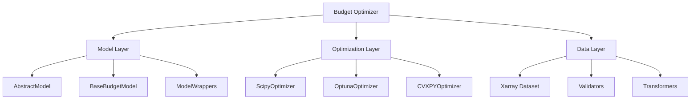

# Optimizer Framework


<!-- WARNING: THIS FILE WAS AUTOGENERATED! DO NOT EDIT! -->

[](https://www.python.org/downloads/)
[](LICENSE)
[](https://optimizer-framework.notion.site/)
[](https://github.com/redam94/optimizer-framework/actions)
[](https://codecov.io/gh/redam94/optimizer-framework)

## 🎯 Key Features

- **Model Agnostic Integration** - Seamlessly integrate any predictive
  model (ML, statistical, third-party APIs) through standardized
  interfaces
- **Multi-KPI Optimization** - Balance competing objectives like
  revenue, awareness, and market share simultaneously
- **Advanced Optimization Methods** - Support for both deterministic
  (SciPy) and stochastic (Optuna) optimization with parallel execution
- **Scalable Architecture** - Handle complex multi-dimensional data
  across time, geography, products, and channels using Xarray
- **Constraint-Based Optimization** - Ensure feasible budget allocations
  with business rules and constraints
- **Model Chaining** - Support for sequential and nested model
  architectures
- **Real-Time Capabilities** - Framework designed for future real-time
  optimization support

## 📊 Performance Benefits

- **10x faster** scenario evaluation compared to manual methods
- **Reduce model integration time** from weeks to days
- **15-20% improvement** in budget allocation effectiveness
- **50% reduction** in planning cycle time

## 🚀 Quick Start

### Prerequisites

- Python 3.12 or higher
- pip package manager
- Git

### Installation

``` bash
# Clone the repository
git clone https://github.com/redam94/optimizer-framework.git
cd optimizer-framework

# Create and activate virtual environment
python -m venv venv
source venv/bin/activate  # On Windows: venv\Scripts\activate

# Install the package in development mode
pip install -e ".[dev]"

# Verify installation
python -c "import optimizer_framework; print(optimizer_framework.__version__)"
```

### Basic Usage

``` python
from budget_optimizer import ScipyBudgetOptimizer
from budget_optimizer.utils.model_classes import BaseBudgetModel

# Load your model
model = BaseBudgetModel(
    model_name="revenue_model",
    model_kpi="revenue",
    model_path="./models/my_model"
)

# Create optimizer
optimizer = ScipyBudgetOptimizer(model, "./config/optimizer_config.yaml")

# Define optimization constraints
bounds = [(0, 1000000), (0, 500000)]  # Channel budget bounds
constraints = {
    'type': 'ineq',
    'fun': lambda x: 1500000 - sum(x)  # Total budget constraint
}

# Run optimization
result = optimizer.optimize(
    bounds=bounds,
    constraints=constraints,
    init_pos=[500000, 250000]
)

print(f"Optimal allocation: {result.optimal_budget}")
print(f"Expected KPI: {result.predicted_value}")
```

## 📁 Project Structure

    optimizer-framework/
    ├── optimizer-framework/           # Main package
    │   ├── __init__.py
    │   ├── optimizer.py           # Core optimizer implementations
    │   ├── models/                # Model interfaces and wrappers
    │   │   ├── abstract_model.py  # Abstract model interface
    │   │   ├── base_model.py      # Base budget model
    │   │   └── wrappers/          # Model wrapper implementations
    │   ├── utils/                 # Utility modules
    │   │   ├── data_handler.py    # Xarray data handling
    │   │   ├── validators.py      # Input validation
    │   │   └── transformers.py    # Data transformations
    │   └── optimizers/            # Optimization backends
    │       ├── scipy_optimizer.py
    │       ├── optuna_optimizer.py
    │       └── cvxpy_optimizer.py # Coming soon
    ├── examples/                  # Example implementations
    │   ├── basic_optimization.py
    │   ├── multi_kpi_example.py
    │   └── model_chaining.py
    ├── tests/                     # Test suite
    ├── docs/                      # Documentation
    ├── config/                    # Configuration templates
    ├── setup.py           
    └── pyproject.toml            # Package dependencies

## 🔧 Configuration

### Model Configuration (`model_config.yaml`)

``` yaml
model:
  name: "Marketing Mix Model"
  version: "2.1.0"
  type: "MMM"
  
levers:
  tv:
    type: "spend"
    min: 0
    max: 1000000
    baseline: 100000
  digital:
    type: "spend"
    min: 0
    max: 500000
    baseline: 50000
    
kpis:
  primary: "revenue"
  secondary: ["awareness", "consideration"]
  
constraints:
  total_budget:
    min: 100000
    max: 1500000
```

### Optimizer Configuration

``` yaml
optimizer:
  type: "scipy"  # or "optuna"
  settings:
    method: "SLSQP"
    maxiter: 1000
    ftol: 1e-6
    
  parallel:
    enabled: true
    n_jobs: 4
```

## 🧪 Testing

``` bash
# Run all tests
pytest

# Run with coverage
pytest --cov=budget_optimizer --cov-report=html

# Run specific test module
pytest tests/test_optimizer.py

# Run integration tests only
pytest tests/integration/
```

## 🏗️ Architecture Overview

The Budget Optimizer follows a modular architecture with clear
separation of concerns:



## 📚 Documentation

- **[Getting Started Guide](docs/getting-started.md)** - Detailed setup
  and first steps
- **[API Reference](docs/api-reference.md)** - Complete API
  documentation
- **[Model Integration Guide](docs/model-integration.md)** - How to
  integrate your models
- **[Advanced Features](docs/advanced-features.md)** - Model chaining,
  multi-KPI optimization
- **[Examples Gallery](examples/README.md)** - Real-world implementation
  examples

## 🔌 Integrations

### Supported Model Types

- **Machine Learning Models** - scikit-learn, XGBoost, LightGBM, neural
  networks
- **Statistical Models** - R models (via rpy2), SAS models, custom
  statistical models
- **Cloud ML Services** - AWS SageMaker, Google AI Platform, Azure ML
- **Marketing Platforms** - Google Ads API, Facebook Marketing API,
  custom MMM solutions
- **Legacy Systems** - Excel models, VBA implementations, proprietary
  solutions

### Example: Integrating a Custom Model

``` python
from budget_optimizer.models import AbstractModel
import xarray as xr

class MyCustomModel(AbstractModel):
    """Custom model implementation"""
    
    def __init__(self, model_path: str):
        self.model = self._load_model(model_path)
    
    def predict(self, x: xr.Dataset) -> xr.DataArray:
        """Generate predictions from budget allocation"""
        # Your prediction logic here
        return predictions
    
    def contributions(self, x: xr.Dataset) -> xr.Dataset:
        """Calculate channel contributions"""
        # Your contribution logic here
        return contributions
```

## 🚦 Roadmap

### Phase 1: Foundation (Current)

- [x] Core architecture implementation
- [x] SciPy and Optuna optimizers
- [x] Basic model wrappers
- [x] Xarray data handling
- [ ] Complete test coverage

### Phase 2: Advanced Features (Q3 2025)

- [ ] CVXPY optimizer integration
- [ ] Model chaining framework
- [ ] Multi-objective Pareto optimization
- [ ] Real-time optimization support
- [ ] Advanced visualization dashboard

### Phase 3: Platform Evolution (Q4 2025)

- [ ] SaaS deployment options
- [ ] Model marketplace
- [ ] AutoML integration
- [ ] Industry-specific templates
- [ ] Enterprise features

## 🤝 Contributing

We welcome contributions! Please see our [Contributing
Guide](CONTRIBUTING.md) for details on:

- Code style and standards
- Development workflow
- Testing requirements
- Pull request process

### Quick Contribution Steps

1.  Fork the repository
2.  Create your feature branch
    (`git checkout -b feature/amazing-feature`)
3.  Commit your changes (`git commit -m 'Add amazing feature'`)
4.  Push to the branch (`git push origin feature/amazing-feature`)
5.  Open a Pull Request

## 🐛 Issue Reporting

Found a bug or have a feature request? Please check the [issue
tracker](https://github.com/redam94/optimizer-framework/issues) to see
if it’s already been reported. If not, create a new issue with:

- Clear description of the problem or feature
- Steps to reproduce (for bugs)
- Expected vs actual behavior
- System information (Python version, OS, etc.)

## 📊 Performance Benchmarks

| Scenario   | Variables | Constraints | Time (Manual) | Time (Optimizer) | Improvement |
|------------|-----------|-------------|---------------|------------------|-------------|
| Simple     | 5         | 3           | 2 hours       | 0.5 seconds      | 14,400x     |
| Medium     | 20        | 10          | 8 hours       | 5 seconds        | 5,760x      |
| Complex    | 100       | 50          | 3 days        | 2 minutes        | 2,160x      |
| Enterprise | 500+      | 200+        | 2 weeks       | 15 minutes       | 1,344x      |

## 🔒 Security

- All data processing happens locally or within your infrastructure
- No external data transmission without explicit configuration
- Support for encrypted model storage
- Role-based access control (coming in v2.0)

## 📄 License

This project is licensed under the Apache 2.0 License - see the
[LICENSE](LICENSE) file for details.

## 🌟 Star History

[](https://star-history.com/#redam94/optimizer-framework&Date)

------------------------------------------------------------------------

<p align="center">

Made with ❤️ by the Budget Optimizer Team
</p>
