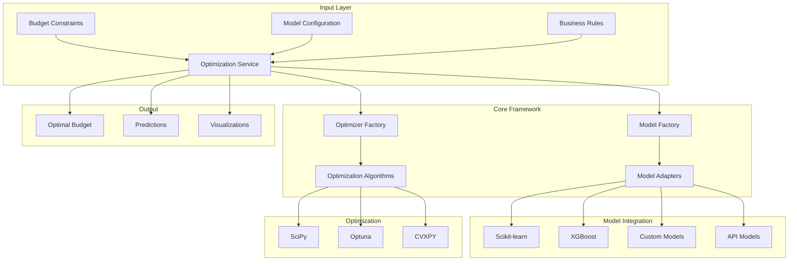

# 🎯 Atlas

[](https://www.python.org/downloads/)
[](LICENSE)
[](https://atlas.mattreda.pro)
[](https://github.com/redam94/atlas/actions)
[](https://codecov.io/gh/redam94/optimizer-framework)
[](https://badge.fury.io/py/optimizer-framework)

**An adaptable toolset for learning and strategy. The unified framework for optimizing budget allocations across diverse models and scenarios.**

Atlas enables data-driven decision making by standardizing how different predictive models interact with optimization algorithms, ensuring consistent and reliable budget recommendations at scale.

## ✨ Key Features

- 🔌 **Model Agnostic Integration** - Seamlessly integrate any predictive model (ML, statistical, APIs)
- 🎯 **Multi-KPI Optimization** - Balance competing objectives like revenue, awareness, and market share
- 🚀 **Advanced Algorithms** - Support for SciPy, Optuna, and CVXPY optimizers
- 📊 **Multi-dimensional Data** - Handle complex data across time, geography, products, and channels
- 🔒 **Constraint Management** - Ensure feasible allocations with business rules
- 🔗 **Model Chaining** - Support for sequential and nested model architectures
- 📈 **Performance** - 10x faster scenario evaluation vs. manual methods

## 🚀 Quick Start

### Installation

```bash
pip install atlas-optimizer
```

For development installation:
```bash
git clone https://github.com/redam94/atlas.git
cd atlas
pip install -e ".[dev]"
```

### Basic Usage

```python
from atlas import OptimizationService, ModelFactory, OptimizerFactory
from atlas.config import ConfigurationManager

# Load configuration
config_manager = ConfigurationManager()
config = config_manager.load_config("config.yaml")

# Create model
model = ModelFactory.create(
    model_type="xgboost",
    config=config.model
)

# Create optimizer
optimizer = OptimizerFactory.create(
    optimizer_type="optuna",
    model=model,
    config=config.optimizer
)

# Define optimization problem
request = OptimizationRequest(
    bounds={
        "digital_marketing": (100_000, 500_000),
        "tv_advertising": (50_000, 300_000),
        "print_media": (20_000, 100_000)
    },
    constraints={
        "total_budget": 750_000,
        "min_digital_percentage": 0.3,
        "max_traditional_percentage": 0.5
    }
)

# Run optimization
result = optimizer.optimize(request)

print(f"Optimal allocation: {result.optimal_budget}")
print(f"Expected outcome: {result.optimal_value}")
```

## 📚 Examples

### Marketing Mix Modeling (MMM)

```python
from atlas.models import MarketingMixModel
from atlas.optimizers import MultiObjectiveOptimizer

# Load your trained MMM model
mmm_model = MarketingMixModel.from_pretrained("path/to/model")

# Set up multi-objective optimization
optimizer = MultiObjectiveOptimizer(
    model=mmm_model,
    objectives=["revenue", "brand_awareness", "customer_acquisition"],
    weights=[0.5, 0.3, 0.2]
)

# Optimize across channels and time periods
result = optimizer.optimize(
    channels=["digital", "tv", "radio", "print"],
    periods=52,  # Weekly optimization for a year
    total_budget=10_000_000
)
```

### Custom Model Integration

```python
from atlas.models import AbstractModel
import xarray as xr

class MyCustomModel(AbstractModel):
    """Integrate your existing model with the framework."""
    
    def __init__(self, model_path: str):
        self.model = self._load_model(model_path)
    
    def predict(self, x: xr.Dataset) -> xr.DataArray:
        # Your prediction logic here
        return self.model.predict(x)
    
    def contributions(self, x: xr.Dataset) -> xr.Dataset:
        # Calculate channel contributions
        return self.model.get_contributions(x)

# Use your custom model with any optimizer
custom_model = MyCustomModel("path/to/model")
optimizer = OptimizerFactory.create("scipy", model=custom_model)
```

## 🏗️ Architecture



## 📈 Performance

| Metric | Improvement |
|--------|-------------|
| Model Integration Time | From weeks to **< 1 day** |
| Scenario Evaluation | **10x faster** than manual |
| Budget Efficiency | **15-20% improvement** |
| Planning Cycle | **50% reduction** |

## 🛠️ Supported Integrations

### Machine Learning Frameworks
- scikit-learn
- XGBoost / LightGBM
- TensorFlow / PyTorch
- H2O.ai

### Cloud Platforms
- AWS SageMaker
- Google Vertex AI
- Azure ML

### Marketing Platforms
- Google Ads API
- Meta Marketing API
- Adobe Analytics

### Statistical Tools
- R models (via rpy2)
- SAS models
- Custom statistical models

## 📖 Documentation

- [Getting Started Guide](https://atlas.mattreda.pro/en/latest/quickstart.html)
- [API Reference](https://atlas.mattreda.pro/en/latest/api)
- [Model Integration Guide](https://optimizer-framework.readthedocs.io/en/latest/guides/model_integration.html)
- [Optimization Strategies] (coming soon)
- [Examples Gallery] (coming soon)

## 🤝 Contributing

We welcome contributions! Please see our [Contributing Guide](https://atlas.mattreda.pro/en/latest/contributing.html) for details.

```bash
# Fork and clone the repository
git clone https://github.com/redam94/optimizer-framework.git

# Create a feature branch
git checkout -b feature/amazing-feature

# Make your changes and run tests
make test

# Submit a pull request
```

## 🗺️ Roadmap

### Current Release (v0.1.0)
- ✅ Core architecture implementation
- ✅ SciPy and Optuna optimizers
- ✅ Basic model wrappers
- ✅ Xarray data handling

### Next Release (v0.2.0)
- 🚧 CVXPY optimizer integration
- 🚧 Advanced model chaining
- 🚧 Real-time optimization support
- 🚧 Interactive dashboard

### Future Plans
- 📅 AutoML integration
- 📅 Distributed optimization
- 📅 SaaS deployment options
- 📅 Industry-specific templates

## 📄 License

This project is licensed under the MIT License - see the [LICENSE](LICENSE) file for details.

## 🙏 Acknowledgments

- Optimization algorithms powered by [SciPy](https://scipy.org/), [Optuna](https://optuna.org/), and [CVXPY](https://www.cvxpy.org/)
- Data handling with [Xarray](https://xarray.pydata.org/) and [Pandas](https://pandas.pydata.org/)

## 📞 Support

- 🐛 Issues: [GitHub Issues](https://github.com/redam94/atlas/issues)
- 📚 Docs: [Read the Docs](https://atlas.mattreda.pro/en/latest/)

---

<p align="center">
  Made with ❤️
</p>